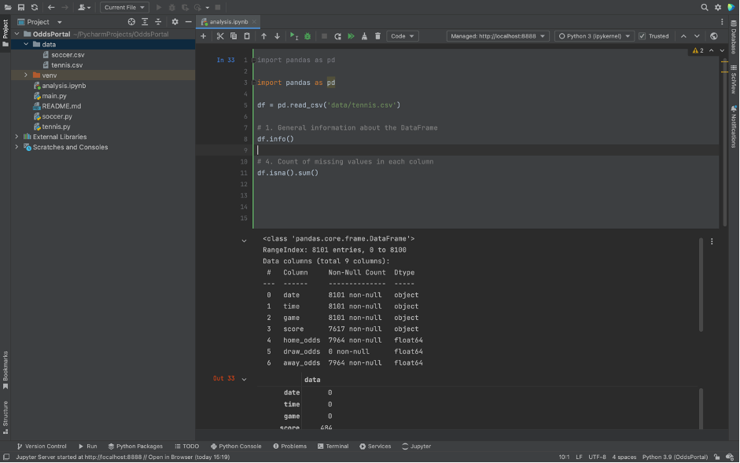
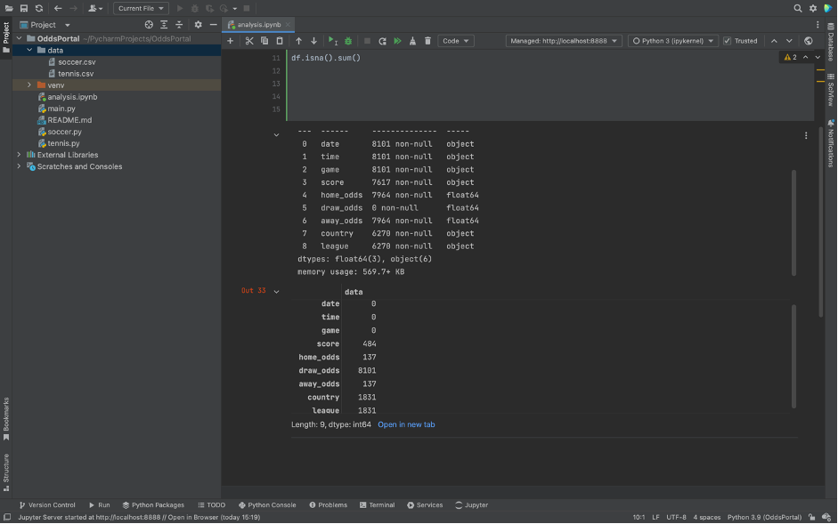
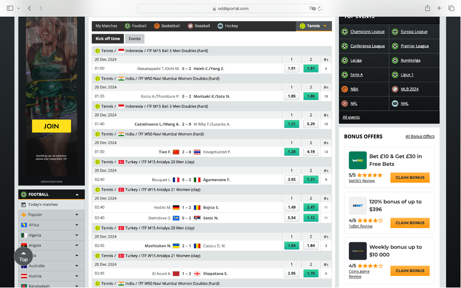

# OddsPortal-Analysis-Parser
=======
# **Profitability Analysis of Betting Strategies Using OddsPortal Data**

## **Project Overview**
This project focuses on analyzing the profitability of betting strategies for two distinct markets:
- **1-2 market** for tennis, where only two outcomes are possible (Player 1 wins or Player 2 wins).
- **1-X-2 market** for soccer, which includes three possible outcomes (Home win, Draw, Away win).

The analysis pipeline begins with **data cleaning** and progresses through **exploratory data analysis (EDA)**, **visualization**, and ultimately to **profitability evaluation**. The primary goal is to evaluate the potential profitability of different betting strategies based on historical odds data.

All data parsing and collection steps have been completed using the scripts `soccer.py` and `tennis.py`, which are available in the repository. The parsed data is stored in the `data/` folder. This README focuses solely on the analysis process.

## **Repository Structure**
- `soccer.py` and `tennis.py`: Scripts used for data scraping from OddsPortal.
- `data/`: Contains the parsed datasets used in the analysis.
- `analysis.ipynb`: Jupyter Notebooks demonstrating the analysis process.

## **Workflow**

---

Now, let's dive into the **analysis process**, starting with preparing the dataset for exploration and evaluation. 

---

### **1. Data Cleaning and Preprocessing**
The first step in the analysis process is cleaning and preparing the dataset. Ensuring the data is structured and free from errors is crucial for reliable analysis. 

For this project, we start by examining the tennis dataset to gain insights into its structure, detect missing values, and identify potential issues. Below are two screenshots that illustrate the initial exploration of the dataset, including data types and missing values. Based on this examination, we will determine the best approach for handling these issues and preparing the data for further analysis.

### **1.1 Datatypes Overview**

### **1.2 Missing Values**

### **2. Parsing Issues Analysis**
To understand the reasons behind missing and incorrect data during parsing, we analyzed the OddsPortal webpage. Below is a screenshot of the parsed page.

### **2.1 Parsing Issues Analysis**

From the screenshot, we can immediately observe the following:
1. Tennis matches do not have draw results, so the draw column can be safely removed.
2. The dataset shows incorrect data for the match **Demidova D. – Senic N.**, with two `NaN` values in the `Country` and `League` columns.
3. Upon analyzing the parsed page, it is clear that some tournaments feature two matches starting simultaneously in the same country and tournament. 

**Conclusion:** The parser failed to capture consecutive events occurring at the same time within a single tournament. To address this issue, the missing values can be filled using the last valid values from the dataset.

