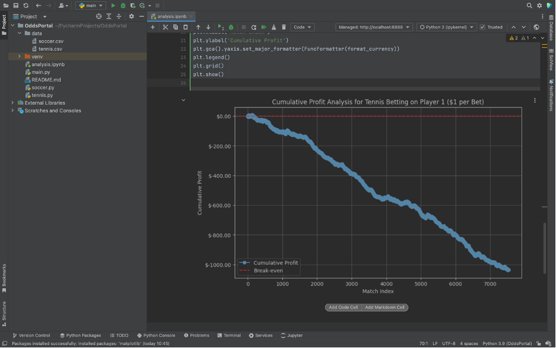
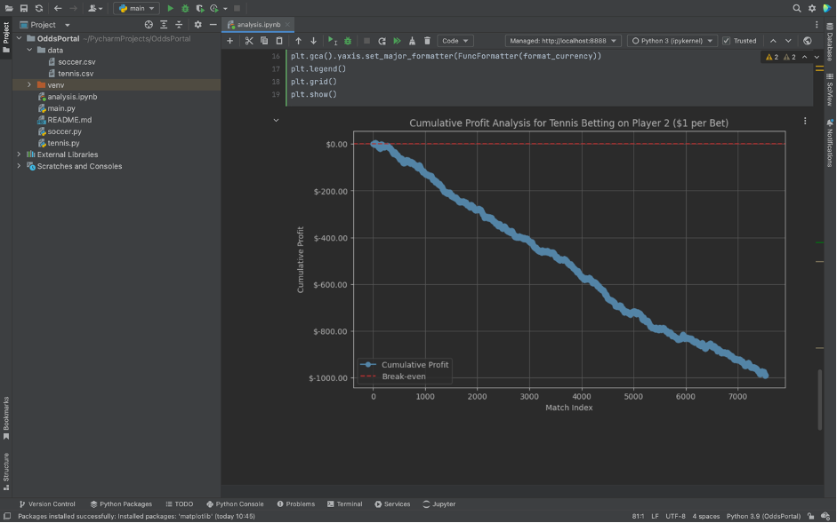
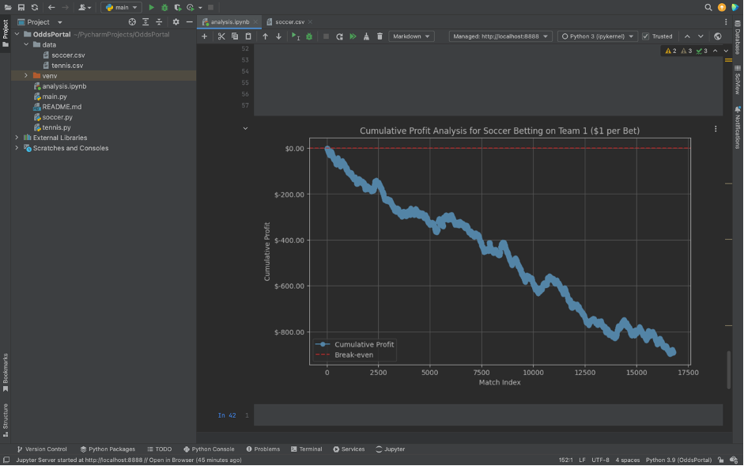
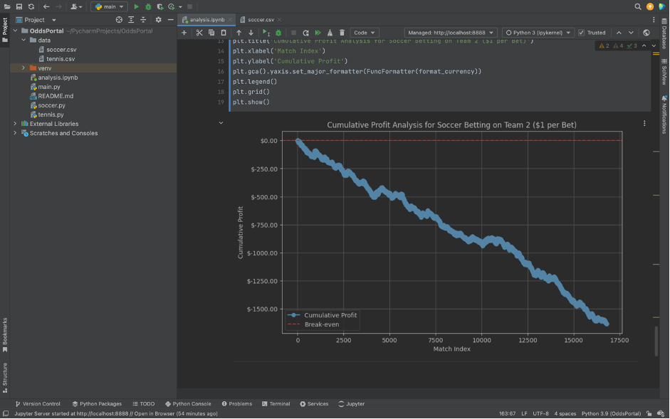
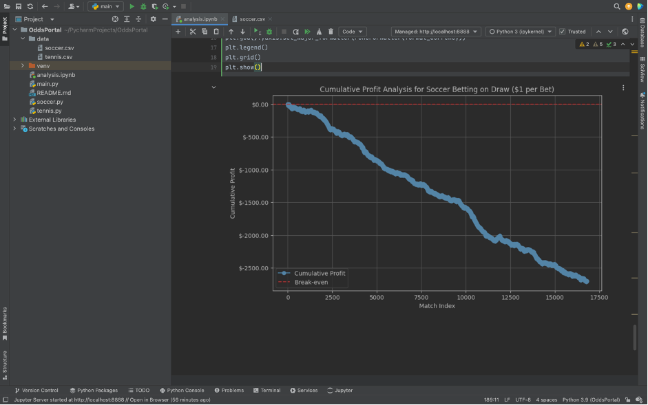

# **Profitability Analysis of Betting Strategies Using OddsPortal Data**

## **Project Overview**
This project focuses on analyzing the profitability of betting strategies for two distinct markets:
- **1-2 market** for tennis, where only two outcomes are possible (Player 1 wins or Player 2 wins).
- **1-X-2 market** for soccer, which includes three possible outcomes (Home win, Draw, Away win).

The analysis pipeline begins with **data cleaning** and progresses through **exploratory data analysis (EDA)**, **visualization**, and ultimately to **profitability evaluation**. The primary goal is to evaluate the potential profitability of different betting strategies based on historical odds data.

All data parsing and collection steps have been completed using the scripts `soccer.py` and `tennis.py`, which are available in the repository. The parsed data is stored in the `data/` folder. This README focuses solely on the analysis process.

## **Repository Structure**
- `soccer.py` and `tennis.py`: Scripts used for data scraping from OddsPortal.
- `data/`: Contains the parsed datasets used in the analysis.
- `analysis.ipynb`: Jupyter Notebooks demonstrating the analysis process.

## **Workflow**

---

Now, let's dive into the **analysis process**, starting with preparing the dataset for exploration and evaluation. 

---

### **1. Data Cleaning and Preprocessing**
The first step in the analysis process is cleaning and preparing the dataset. Ensuring the data is structured and free from errors is crucial for reliable analysis. 

For this project, we start by examining the tennis dataset to gain insights into its structure, detect missing values, and identify potential issues. Below are two screenshots that illustrate the initial exploration of the dataset, including data types and missing values. Based on this examination, we will determine the best approach for handling these issues and preparing the data for further analysis.

#### **1.1 Datatypes Overview**

#### **1.2 Missing Values**

### **2. Parsing Issues Analysis**
To understand the reasons behind missing and incorrect data during parsing, we analyzed the OddsPortal webpage. Below is a screenshot of the parsed page.

#### **2.1 Parsing Issues Analysis**

From the screenshot, we can immediately observe the following:
1. Tennis matches do not have draw results, so the draw column can be safely removed.
2. The dataset shows incorrect data for the match **Demidova D. – Senic N.**, with two `NaN` values in the `Country` and `League` columns.
3. Upon analyzing the parsed page, it is clear that some tournaments feature two matches starting simultaneously in the same country and tournament. 

**Conclusion:** The parser failed to capture consecutive events occurring at the same time within a single tournament. To address this issue, the missing values can be filled using the last valid values from the dataset.

### **3. Data Cleaning: Handling Missing Values**
After identifying missing and incorrect values in the dataset, the following cleaning steps were performed:
1. Converted the `date` column to a standard datetime format.
2. Forward-filled missing values in the `date`, `country`, and `league` columns.
3. Removed the `draw_odds` column, as draws are not applicable in tennis matches.

Below is a screenshot demonstrating these cleaning steps:

#### **3.1 Data Cleaning Process**

### **4. Feature Engineering: Creating New Columns**
The next step involves feature engineering to prepare the dataset for analysis. This includes:

1. Removing rows with missing values in the `score` column, as these cannot be analyzed.
2. Splitting the `score` column into two new columns: `sets_player1` and `sets_player2`, representing the number of sets won by each player.
3. Creating two additional columns, `winner_player1` and `winner_player2`, to identify the winner of each match based on the set scores.

Below is a screenshot demonstrating these feature engineering steps:

#### **4.1 Feature Engineering: Creating Sets and Winners Columns**

### **5. Profit Analysis and Visualization for Tennis**
After preparing the dataset, we moved on to analyzing the player's profit if they consistently bet on the same outcome across the entire dataset.

**Steps involved:**
1. Created a `profit` column to calculate the player's profit for each match.
2. Added a `cumulative_profit` column to track the total profit, used for plotting the graph.
3. Reset the index after removing rows to ensure proper visualization.
4. Defined a custom function to format Y-axis values with a `$` symbol for better readability.

Below is a screenshot of the code used for profit analysis and visualization:

#### **5.1 Columns Creation and Visualization Code**

#### **5.2 Betting on Player 1**

This graph demonstrates the cumulative profit if a player consistently bets $1 on Player 1 across the dataset. The results show that over 7,530 matches, the total loss amounts to more than $1,000.

#### **5.3 Betting on Player 2**

This graph illustrates the cumulative profit when consistently betting $1 on opponents (Player 2). The results are slightly better than betting on Player 1, but the total loss is still around $1,000

### **6. Profit Analysis and Visualization for Soccer**

Similar to the process for tennis, we applied the same steps for soccer, including data cleaning, feature engineering, and visualization. This involved:

Below are the results of these analyses:

#### **6.1 Columns Creation and Visualization Code**

#### **6.2 Betting on Draw (X)**

This graph demonstrates the cumulative profit when consistently betting $1 on a draw result. As seen, this strategy also results in a consistent loss over the dataset.

#### **6.3 Betting on Away Win (2)**

This graph demonstrates the cumulative profit when consistently betting $1 on a draw result. As seen, this strategy also results in a consistent loss over the dataset.

